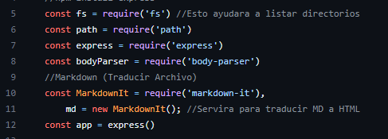
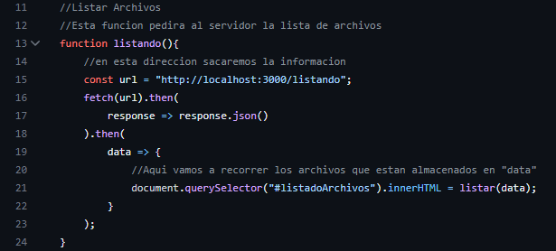
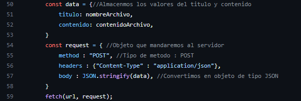
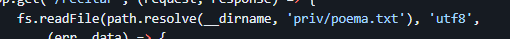
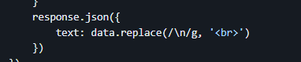

<table>
    <theader>
        <tr>
            <td></td>
            <th>
                UNIVERSIDAD NACIONAL DE SAN AGUSTIN 
                FACULTAD DE INGENIERÍA DE PRODUCCIÓN Y SERVICIOS 
                ESCUELA PROFESIONAL DE INGENIERÍA DE SISTEMAS
            </th>
            <td></td>
        </tr>
    </theader>
    <tbody>
        <tr><td colspan="3">Formato: Guía de Práctica de Laboratorio / Talleres / Centros de Simulación</td></tr>
        <tr><td>Aprobación:  2022/03/01</td><td>Código: GUIA-PRLD-001</td><td>Página: 1</td></tr>
    </tbody>
</table>

INFORME DE LABORATORIO 
(formato estudiante)

<table>
<theader>
<tr><th colspan="6">INFORMACIÓN BÁSICA</th></tr>
</theader>
<tbody>
<tr><td>ASIGNATURA:</td><td colspan="5">Programación Web 2</td></tr>
<tr><td>TÍTULO DE LA PRÁCTICA:</td><td colspan="5">Ajax y NodeJS</td></tr>
<tr>
<td>NÚMERO DE PRÁCTICA:</td><td>03</td><td>AÑO LECTIVO:</td><td>2023 A</td><td>NRO. SEMESTRE:</td><td>III</td>
</tr>
<tr>
<tr><td>REPOSITORIO:</td><td colspan="5">https://github.com/ianthony4/PWEB2-LAB03.git</td></tr>
</tr>
<tr>
<td>FECHA DE PRESENTACIÓN:</td><td colspan="2">24-05-2023</td><td>HORA DE PRESENTACIÓN:</td><td colspan="2">por definir</td>
</tr>
<tr><td colspan="4">INTEGRANTE (s):
<ul>
<li>Chaisa Fernandez, Anthony Leonel</li>
</ul>
</td>
<td>NOTA:</td><td>Pendiente</td>
</tr>
<tr><td colspan="6">DOCENTES:
<ul>
<li>Carlo Jose Luis Corrales Delgado (ccorrales@unsa.edu.pe)</li>
<li>Richart Smith Escobedo Quispe (rescobedoq@unsa.edu.pe)</li>
</ul>
</td>

</tr>
</tbody>
</table>
<table>
<theader>
<tr><th>SOLUCIÓN Y RESULTADOS</th></tr>
</theader>
<tbody>
<tr><td>I. SOLUCIÓN DE EJERCICIOS/PROBLEMAS 
A. Solucion del Trabajo Grupal: 
<ul>
<li>Durante el desarrollo de esta practica se tuvieron MUCHAS DIFICULTADES:</li>
Mencionaremos algunas, pero ahora la mas importante.
<ul><li>Conexion entre los pedidos de client.js al servidor:</li>
Me parecio un tema bastante delicado, saber que como recoger los objetos, como extraer la informacion de los objetos, como mandar objetos, etc. 
Por otro lado el listado de directorios tambien fue un tema de busqueda, no fue complicado pero si interesante, donde el uso de "fs" lee, escribe, crea archivos, directorios, etc.
<li>Uso de Bibliotecas ($ npm)</li>
Es cierto que el docente, proporciono las bibliotecas completas (fs, body-parser, markdownIt) pero su uso para este laboratorio fue de un espectro personalmente mas amplio, nada fuera del otro mundo, pero tuvo trabajo
</ul>
<li>Por otro lado, se aprendio nuevas cosas:</li>
Donde los pedidos por metodos GET y POST requieren una forma distinta de asignarlos a sus objetos JSON.
<ul><li>Peticiones por GET, solo necesitan la url</li>
<li>Peticiones por POST, necesitan que nosotros creemos el JSON de forma manual, indicando el metodo, el header y debemos SERIALIZAR los objetos JSON donde estaran los datos enviados</li></ul>
<ul><li>Uso, del "querySelector()":</li>
Se tuvo que reestructurar el archivo "index.html" debido a que la estructura original era muy "complicada" de entender, se hacia un uso excesivo de los "id's", donde llegaron incluso a confundirme, crear una nueva estructura HTML limpia y planificada, trajo consigo mejores beneficios: <ul><li>HTML mas facil de entender</li><li>Referencias a las clases, secciones, id's y tag en general con mas claridad para usarlo en el "client.js"</li><li>Creacion de un archivo CSS mas simple de entender</li></ul><ul></ul>
</td></tr>
<tr><td>II. SOLUCIÓN DEL CUESTIONARIO 
<b>A. En el Ejemplo "Hola Mundo" con NodeJS. ¿Qué pasó con la línea: "Content type ….."?</b> 
Respuesta:  
<ul><li>No se uso, pero tengo entendido que el cliente traduce la ventana con una plantilla html preinstalada,  la cabecera "content-type" indica al cliente (generalmente un navegador web) el tipo de datos que está recibiendo en la respuesta del servidor. para los demas ejercicios resueltos se indico que el contenido de la respuesta es un archivo  en formato JSON</li></ul>
<b>B. En los ejercicios. ¿En qué lugar debería estar el archivo poema.txt?</b> 
Respuesta:  
<ul><li>Deberia ubicarse en la carpeta 'priv', exactamente en "./priv/poema.txt"</li>
</ul>
<b>C. ¿Entiende la expresión regular en el código y se da cuenta de para qué es útil? </b> 
Respuesta:  
<ul><li>Se usaron para remplazar los saltos de linea "\n" por la etiqueta "br", para que el texto en html se muestre de forma original al texto ubicado en .txt</li>
</ul>
<b>D. Note que la respuesta del servidor está en formato JSON, ¿Habrá alguna forma de verla directamente?</b> 
Respuesta:  
<ul><li>El motodo "response.send() envia cadena y arrays sin necesidad de usar JSON, es una alternativa para verlo de forma directa</li></ul>
</td></tr>
<tr><td>III. CONCLUSIONES
<ul> 
<li>NodeJS resulto ser un herramienta interesante en JavaScript, sobretodo porque esta enfocado en el lado del BACKEND, donde se demostro que podemos manupular archivos, procesar de forma asincrona, tambien el uso de los diferentes paquetes facilita la aplicacion de los diferentes tipos de proyectos.</li> 
<li>AJAX por otro lado, es una tecnica importante para ejecutar solicitudes de forma asincronas al servidor y actualizar partes especificas de una pagina, SIN TENER QUE RECARGARLA por completo, muy util.</li>

</ul>
</td></tr>
</tbody>
</table>
<table>
<theader>
<tr><th>RETROALIMENTACIÓN GENERAL</th></tr>
</theader>
<tbody>
<tr><td>I. RETROALIMENTACIÓN:</td></tr>
<tbody>
</table>
<table>
<theader>
<tr><th>REFERENCIAS Y BIBLIOGRAFÍA</th></tr>
</theader>
<tbody>
<tr><td>I. BIBLIOGRAFÍA
<ul>
<li>https://www.w3schools.com/js/default.asp</li>
<li>https://www.w3schools.com/js/js_ajax_intro.asp</li>
<li>https://www.w3schools.com/nodejs/</li>
<li>https://www.w3schools.com/html/</li>
<li>https://expressjs.com/en/guide/migrating-4.html</li>
<li>https://developer.mozilla.org/es/docs/Web/API/Fetch_API/Using_Fetch</li>
<li>https://www.w3schools.com/js/js_api_fetch.asp</li>
</ul>
</td></tr>
</tbody>
</table>